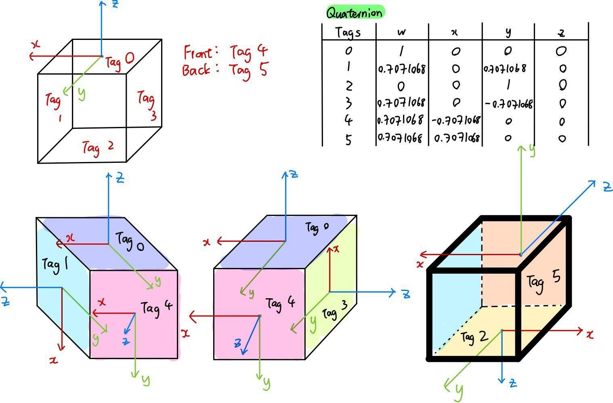
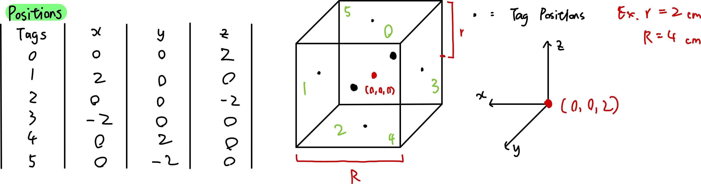

<!-- ABOUT THE PROJECT -->
## Object Localization using AprilTag ROS for Robotics

[![Product Name Screen Shot][product-screenshot]](https://example.com)


### Built With

* Ubuntu 18.04
* [ROS Melodic](http://wiki.ros.org/melodic/Installation/Ubuntu)
* [OpenCV](https://docs.opencv.org/3.4/d7/d9f/tutorial_linux_install.html)


<!-- GETTING STARTED -->
## Getting Started
1. **Install ROS USB driver**

    1. Clone ROS USB camera driver
        ```sh
       mkdir -p catkin_ws/src && cd catkin_ws/src
       git clone https://github.com/bosch-ros-pkg/usb_cam.git
       ```
    2. Create USB camera directory
       ```sh
       cd ..
       catkin_make
       ```
    3. Set up ROS environment
       ```sh
       source ./devel/setup.bash  # need to run this command everytime a new terminal window is opened
       ```
    4. Build ennvironment
       ```sh
       cd src/usb_cam
       mkdir build && cd build
       cmake ..
       ```
    5. Check available cameras/webcams (make sure camera is connected)
        ```sh
        sudo apt-get install v4l-utils
        v4l2-ctl --list-devices

        # sample output
        # Integrated Camera (usb-0000:00:1a.0-1.6):
        #         /dev/video0
        ```
    6. Launch USB camera
        ```sh
        cd ..
        cd launch
        roslaunch usb_cam usb_cam-test.launch
        ```
2. **Install AprilTag_ros driver**
    1. Clone AprilTag repo
        ```sh
        cd ~/  # or choose other installation location
        git clone https://github.com/AprilRobotics/apriltag.git
        ```
    2. Install AprilTag
        ```sh
        cd apriltag
        mkdir build && cd build
        cmake ..
        sudo make install
        ```
    3. Clone AprilTag_ros repo and install
        ```sh
        cd ~/catkin_ws/src
        git clone https://github.com/AprilRobotics/apriltag_ros.git
        cd ..
        catkin_make
        ```
3. **Camera Calibration**
    1. Install ROS camera calibration package
        ```sh
        sudo apt-get install ros-melodic-camera-calibration
        ```
    2. Perform camera calibration
        ```sh
        roslaunch usb_cam usb_cam-test.launch  # turn on USB camera
        rosrun camera_calibration cameracalibrator.py --size 8x6 --square 0.024 image:=/usb_cam/image_raw camera:=/usb_cam
        ```
    The example above uses an 8x6 checkerboard with 24mm squares (Calibration uses the interior vertex points of the checkerboard, so an "9x7" board uses the interior vertex parameter "8x6" as in the example below). 

    _Download the official ROS 8x6 checkerboard [here](http://wiki.ros.org/camera_calibration/Tutorials/MonocularCalibration?action=AttachFile&do=view&target=check-108.pdf)._

    Move checkerboard up/down/left/right until "CALIBRATE" button turns green, then click on "CAILIBRATE", wait for the system to complete calibration calculation, then click on "SAVE", then "COMMIT".

    _When you click on the "Save" button after a succesfull calibration, the data (calibration data and images used for calibration) will be written to /tmp/calibrationdata.tar.gz._

## Usage
1. **Using AprilTag_Ros and Detecting AprilTags**
    1. go to /apriltag_ros/apriltag_ros/config and configure **settings.yaml** and **tags.yaml**.
    
        check out http://wiki.ros.org/apriltag_ros/Tutorials/Detection%20in%20a%20video%20stream for parameter setup.

        1. settings.yaml 
            ```yaml
            tag_family:        'tag36h11'
            tag_border:        1 
            tag_threads:       2 
            tag_decimate:      1.0 
            tag_blur:          0.0 
            tag_refine_edges:  1 
            tag_refine_decode: 0 
            tag_refine_pose:   0 
            tag_debug:         0 
            publish_tf:        true
            ```
        2. tags.yaml (Values based on the diagram below)
            ```yaml
            standalone_tags:
              [
                {id: 10, size: 0.15},
                {id: 20, size: 0.1},
                {id: 30, size: 0.07}
              ]
            tag_bundles:
              [
                {
                  name: 'my_bundle',
                  layout:
                    [
                      {id: 0, size: 0.05, x: 0.0000, y: 0.0000, z: 0.0, qw: 1.0, qx: 0.0, qy: 0.0, qz: 0.0},
                      {id: 4, size: 0.05, x: 0.0548, y: -0.0522, z: 0.0, qw: 1.0, qx: 0.0, qy: 0.0, qz: 0.0},
                      {id: 3, size: 0.05, x: -0.0580, y: -0.0553, z: 0.0, qw: 1.0, qx: 0.0, qy: 0.0, qz: 0.0},
                      {id: 2, size: 0.05, x: 0.0543, y: 0.0603, z: 0.0, qw: 1.0, qx: 0.0, qy: 0.0, qz: 0.0},
                      {id: 1, size: 0.05, x: -0.0582, y: 0.0573, z: 0.0, qw: 1.0, qx: 0.0, qy: 0.0, qz: 0.0}
                    ]
                }
              ]
              ```
            





<!-- USAGE EXAMPLES -->
## Usage

Use this space to show useful examples of how a project can be used. Additional screenshots, code examples and demos work well in this space. You may also link to more resources.

_For more examples, please refer to the [Documentation](https://example.com)_

<p align="right">(<a href="#readme-top">back to top</a>)</p>


<!-- ROADMAP -->
## Roadmap

- [ ] Feature 1
- [ ] Feature 2
- [ ] Feature 3
    - [ ] Nested Feature

See the [open issues](https://github.com/github_username/repo_name/issues) for a full list of proposed features (and known issues).

<p align="right">(<a href="#readme-top">back to top</a>)</p>


<!-- CONTRIBUTING -->
## Contributing

Contributions are what make the open source community such an amazing place to learn, inspire, and create. Any contributions you make are **greatly appreciated**.

If you have a suggestion that would make this better, please fork the repo and create a pull request. You can also simply open an issue with the tag "enhancement".
Don't forget to give the project a star! Thanks again!

1. Fork the Project
2. Create your Feature Branch (`git checkout -b feature/AmazingFeature`)
3. Commit your Changes (`git commit -m 'Add some AmazingFeature'`)
4. Push to the Branch (`git push origin feature/AmazingFeature`)
5. Open a Pull Request

<p align="right">(<a href="#readme-top">back to top</a>)</p>


<!-- LICENSE -->
## License

Distributed under the MIT License. See `LICENSE.txt` for more information.

<p align="right">(<a href="#readme-top">back to top</a>)</p>


<!-- CONTACT -->
## Contact

Your Name - [@twitter_handle](https://twitter.com/twitter_handle) - email@email_client.com

Project Link: [https://github.com/github_username/repo_name](https://github.com/github_username/repo_name)

<p align="right">(<a href="#readme-top">back to top</a>)</p>


<!-- ACKNOWLEDGMENTS -->
## Acknowledgments

* []()
* []()
* []()

<p align="right">(<a href="#readme-top">back to top</a>)</p>


<!-- MARKDOWN LINKS & IMAGES -->
<!-- https://www.markdownguide.org/basic-syntax/#reference-style-links -->
[contributors-shield]: https://img.shields.io/github/contributors/github_username/repo_name.svg?style=for-the-badge
[contributors-url]: https://github.com/github_username/repo_name/graphs/contributors
[forks-shield]: https://img.shields.io/github/forks/github_username/repo_name.svg?style=for-the-badge
[forks-url]: https://github.com/github_username/repo_name/network/members
[stars-shield]: https://img.shields.io/github/stars/github_username/repo_name.svg?style=for-the-badge
[stars-url]: https://github.com/github_username/repo_name/stargazers
[issues-shield]: https://img.shields.io/github/issues/github_username/repo_name.svg?style=for-the-badge
[issues-url]: https://github.com/github_username/repo_name/issues
[license-shield]: https://img.shields.io/github/license/github_username/repo_name.svg?style=for-the-badge
[license-url]: https://github.com/github_username/repo_name/blob/master/LICENSE.txt
[linkedin-shield]: https://img.shields.io/badge/-LinkedIn-black.svg?style=for-the-badge&logo=linkedin&colorB=555
[linkedin-url]: https://linkedin.com/in/linkedin_username
[product-screenshot]: images/screenshot.png
[Next.js]: https://img.shields.io/badge/next.js-000000?style=for-the-badge&logo=nextdotjs&logoColor=white
[Next-url]: https://nextjs.org/
[React.js]: https://img.shields.io/badge/React-20232A?style=for-the-badge&logo=react&logoColor=61DAFB
[React-url]: https://reactjs.org/
[Vue.js]: https://img.shields.io/badge/Vue.js-35495E?style=for-the-badge&logo=vuedotjs&logoColor=4FC08D
[Vue-url]: https://vuejs.org/
[Angular.io]: https://img.shields.io/badge/Angular-DD0031?style=for-the-badge&logo=angular&logoColor=white
[Angular-url]: https://angular.io/
[Svelte.dev]: https://img.shields.io/badge/Svelte-4A4A55?style=for-the-badge&logo=svelte&logoColor=FF3E00
[Svelte-url]: https://svelte.dev/
[Laravel.com]: https://img.shields.io/badge/Laravel-FF2D20?style=for-the-badge&logo=laravel&logoColor=white
[Laravel-url]: https://laravel.com
[Bootstrap.com]: https://img.shields.io/badge/Bootstrap-563D7C?style=for-the-badge&logo=bootstrap&logoColor=white
[Bootstrap-url]: https://getbootstrap.com
[JQuery.com]: https://img.shields.io/badge/jQuery-0769AD?style=for-the-badge&logo=jquery&logoColor=white
[JQuery-url]: https://jquery.com 
